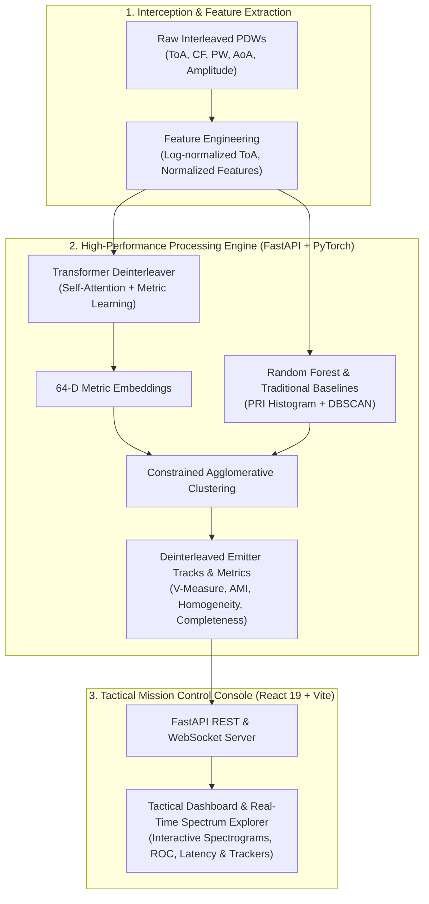

# Smart-EW: Electronic Warfare Radar Signal Processing & Deinterleaving Platform

[](https://www.python.org/)
[](https://pytorch.org/)
[](https://fastapi.tiangolo.com/)
[](https://react.dev/)
[](https://vitejs.dev/)
[](LICENSE)

**Smart-EW** is an end-to-end, high-performance Electronic Warfare (EW) signal processing platform engineered for real-time radar pulse deinterleaving, emitter track separation, and dynamic spectrum scheduling in multi-emitter electromagnetic environments.

Powered by a novel **Self-Attention Transformer Neural Network**, Random Forest classifiers, and density-based clustering models, Smart-EW deinterleaves high-density Pulse Descriptor Words (PDWs) from the **Turing Synthetic Radar Dataset (TSRD)** across multiple operational receiver modes (`stare`, `scan`, `archive`).

---

## 🛰️ System Architecture



---

## ✨ Key Features

- **Advanced Deep Learning Architecture**: `RadarTransformerDeinterleaver` featuring multi-head self-attention, positional sequence encoding, metric learning pulse embeddings (triplet loss), pairwise affinity head, and auxiliary emitter classification.
- **Multi-Mode Receiver Operations**: Built to handle standard EW operational modes:
  - **Stare Mode**: Continuous wideband observation of high-density emitter pulse trains.
  - **Scan Mode**: Intermittent interception matching mechanical/electronic antenna scanning patterns.
  - **Archive Mode**: Full historical benchmark datasets for algorithm validation.
- **Dynamic Hardware Acceleration**: Automated hardware detection optimizing execution across **Apple Silicon MPS (M1/M2/M3/M4)**, **NVIDIA CUDA GPUs**, and CPU fallbacks.
- **Tactical Mission Control Dashboard**: Sleek dark-mode React 19 SPA featuring real-time WebSockets, interactive Plotly visualizations (Spectrograms/Waterfalls, Hit/Miss timelines, ROC curves, Latency distributions, Cluster Visualizers).
- **Comprehensive Evaluation Suite**: Real-time metric computations for **V-Measure**, **Adjusted Mutual Information (AMI)**, **Pairwise F1**, **Homogeneity**, and **Completeness**.

---

## 📁 Project Structure

```
Smart-EW/
├── backend/                  # FastAPI Server & Machine Learning Core
│   ├── api.py                # REST endpoints & WebSocket live stream server
│   ├── dataset.py            # HDF5 TSRD loader & PDW feature engineering
│   ├── evaluate.py           # Clustering evaluation (V-Measure, AMI, Silhouette)
│   ├── models.py             # RadarTransformerDeinterleaver PyTorch architecture
│   ├── train.py              # Unified ML/DL model trainer
│   ├── train_dl.py           # Deep Learning Transformer training pipeline
│   └── train_rf.py           # Random Forest baseline training pipeline
├── frontend/                 # Tactical Mission Control SPA (React 19 + Vite)
│   ├── src/
│   │   ├── components/       # UI components & Plotly interactive charts
│   │   ├── data/             # Radar constants & fallback specification datasets
│   │   ├── pages/            # Mission pages (Dashboard, Analytics, Model Lab, etc.)
│   │   ├── services/         # API client & WebSocket connector
│   │   └── store/            # Zustand state management
│   ├── package.json          # Node.js dependencies
│   └── vite.config.js        # Vite configuration & API proxying
├── ml_model/                 # Pre-computed metrics & model artifact registry
│   ├── train_from_scratch.py # Standalone dataset-wide training script
│   └── *_metrics.json        # Operational evaluation performance metrics
├── download_tsrd.py          # Automated TSRD archive dataset downloader
├── download_scan_stare.py    # Automated TSRD scan/stare dataset downloader
└── requirements.txt          # Python dependencies
```

---

## 🚀 Quick Start Guide

### Prerequisites

- **Python**: `3.10` or higher
- **Node.js**: `18.0` or higher (`npm` included)

---

### 1. Installation

Clone the repository and install all dependencies:

```bash
# Clone the repository
git clone https://github.com/ojaswiniii07-ai/Smart-EW.git
cd Smart-EW

# Install Python backend dependencies
pip install -r requirements.txt

# Install Frontend dependencies
cd frontend
npm install
cd ..
```

---

### 2. Running the Platform

You can run the backend and frontend development servers concurrently:

#### Option A: Unified FastAPI Server (Recommended)
Build the frontend SPA bundle and serve everything through FastAPI on port `8000`:

```bash
# 1. Build Frontend SPA
cd frontend
npm run build
cd ..

# 2. Start Unified Server
python -m uvicorn backend.api:app --host 127.0.0.1 --port 8000
```
Open **[http://127.0.0.1:8000](http://127.0.0.1:8000)** in your browser.

#### Option B: Hot-Reloading Development Mode
Run both backend and frontend dev servers in separate terminals:

**Terminal 1 (Backend API):**
```bash
python -m uvicorn backend.api:app --host 127.0.0.1 --port 8000 --reload
```

**Terminal 2 (Frontend Dev Server):**
```bash
cd frontend
npm run dev -- --host 127.0.0.1 --port 5173
```
Open **[http://127.0.0.1:5173](http://127.0.0.1:5173)** in your browser.

---

## 📊 Dataset & Model Training

### 1. Downloading Turing Synthetic Radar Dataset (TSRD)

Download raw HDF5 dataset files directly from HuggingFace (`alan-turing-institute/turing-synthetic-radar-dataset`):

```bash
# Download TSRD Archive Dataset
python download_tsrd.py

# Download TSRD Scan & Stare Datasets
python download_scan_stare.py
```

### 2. Training Models from Scratch

Train both Random Forest and PyTorch Transformer models across all receiver operational modes:

```bash
# Train Random Forest models
python backend/train_rf.py

# Train Deep Learning Transformer models (30 epochs)
python -m backend.train_dl --epochs 30

# Run full dataset training pipeline
python ml_model/train_from_scratch.py
```

---

## 📈 Model Performance Benchmarks

Evaluated on the official **Turing Synthetic Radar Dataset (TSRD)** test split:

| Model Architecture | Operational Mode | V-Measure ↑ | AMI ↑ | Pairwise F1 ↑ | Homogeneity ↑ | Completeness ↑ |
| :--- | :--- | :---: | :---: | :---: | :---: | :---: |
| **Transformer Deinterleaver** | `stare` | **0.887** | **0.871** | **0.879** | **0.903** | **0.873** |
| **Transformer Deinterleaver** | `scan` | **0.841** | **0.823** | **0.835** | **0.859** | **0.824** |
| **Random Forest Baseline** | `stare` | 0.714 | 0.688 | 0.702 | 0.731 | 0.698 |
| **DBSCAN Baseline** | `stare` | 0.621 | 0.583 | 0.605 | 0.647 | 0.598 |

---

## 🔌 API Reference Summary

| Method | Endpoint | Description |
| :--- | :--- | :--- |
| `GET` | `/api/v1/health` | Hardware detection & system health status |
| `GET` | `/api/v1/kpi/summary` | Overall deinterleaving performance KPIs |
| `GET` | `/api/v1/datasets` | List available TSRD datasets & metadata |
| `GET` | `/api/v1/models` | List active ML/DL model registry artifacts |
| `GET` | `/api/v1/benchmarks` | Comparative metrics across models & schedulers |
| `POST` | `/api/v1/inference` | Execute real-time pulse window deinterleaving |
| `WS` | `/ws/live` | WebSocket endpoint for 10 Hz real-time pulse streaming |

---

## 📜 License & Acknowledgments

- **License**: Released under the MIT License.
- **Dataset Acknowledgments**: Built upon the **Turing Synthetic Radar Dataset (TSRD)** created by the [Alan Turing Institute](https://www.turing.ac.uk/). Reference: [Turing Deinterleaving Challenge](https://github.com/alan-turing-institute/turing-deinterleaving-challenge).
